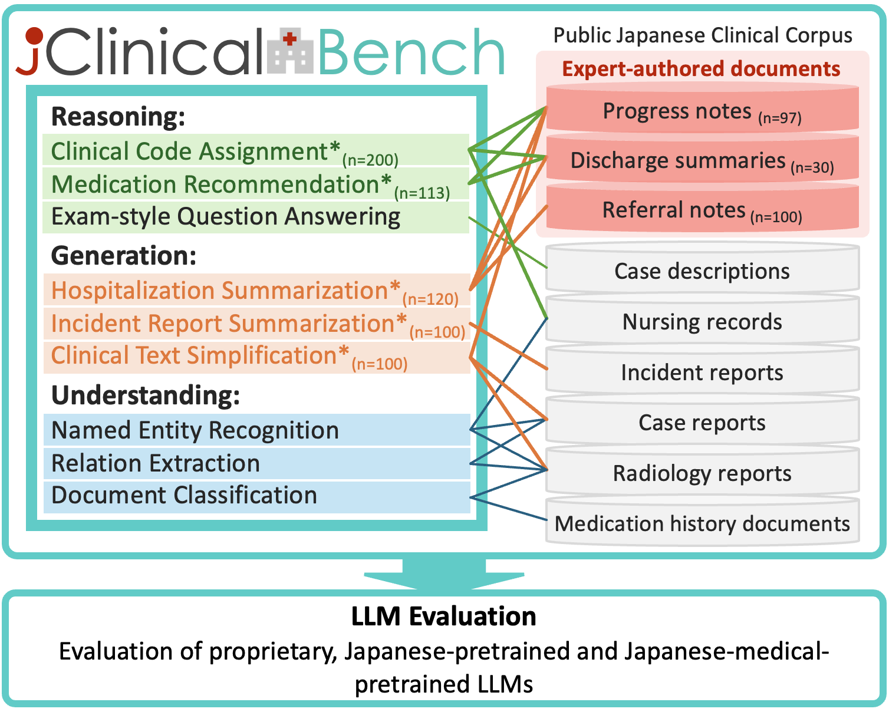

# J-ClinicalBench

This repository contains raw clinical documents, annotated dtasets and evaluation results of the paper "J-ClinicalBench: A Benchmark for Evaluating Large Language Models on Practical Clinical Tasks in Japanese".

## Overview



J-ClinicalBench consists of **nine clinical NLP tasks** organized into three capability groups:

- **Reasoning** (Clinical Code Assignment, Medication Recommendatoin, Exam-style QA)
- **Generation** (Hospitalization Summarization, Incident Report Summarization, Clinical Text Simplification)
- **Understanding** (Named Entiry Recognition, Relation Extraction, Document Classification)

## 📂 Folder Structure

```text
J-ClinicalBench-release/
├── assets/
├── data/
│   ├── benchmarks/        
│   ├──generated/
│   └── raw/               
│   
├── results/
└── README.md
```

## 🗂️ `data/raw` Document Types

Raw documents used in the benchmark

- `CR/`: Case reports
- `NR/`: Nursing records
- `RR/`: Radiology reports
- `DS/`: Discharge summaries
- `PN/`: Progress notes
- `IR/`: Incident reports
- `MH/`: Medication history documents
- `RN/`: Referral notes

## 📋 Tasks in `data/benchmarks`

Datasets marked with `⋆` are newly constructed in this benchmark.

### 🧠 Clinical Reasoning Tasks

#### 1. Clinical Code Assignment (CCA) ⋆

- Input: Clinical note (`text` column of `data/benchmarks/CLR/CCA/data.csv`)
- Output: All corresponding diagnostic codes (MedDRA) (`medra_list` column of `data/benchmarks/CLR/CCA/data.csv`)

#### 2. Medication Recommendation (MR) ⋆

- Input: Clinical note (`text` column of `data/benchmarks/CLR/MR/data.csv`)
- Output: Recommended medications (`medications` column of `data/benchmarks/CLR/MR/data.csv`)

#### 3. Exam-style Question Answering (ExamQA)

- Source: Adapted from IGAKU QA benchmark
- Input: Medical exam question (`question` and `options` fields of `data/benchmarks/CLR/MCQA/igakuqa_clinical_test.jsonl` and `data/benchmarks/CLR/MCQA/igakuqa_clinical_train.jsonl`)
- Output: Correct answer choice (`answer_idx` field in the same JSONL files)

### ✍️ Clinical Generation Tasks

#### 4. Hospitalization Summarization ⋆

- Input:
  - DS setting: hospitalization/discharge text (`text` column of `data/benchmarks/CLG/HS_DS/data_ds.csv`)
  - PN setting: note collection (`notes` field of `data/benchmarks/CLG/HS_PN/data.json`)
- Output:
  - DS setting: concise summary (`summary` column of `data/benchmarks/CLG/HS_DS/data_summary.csv`)
  - PN setting: concise summary (`summary` field of `data/benchmarks/CLG/HS_PN/data.json`)

#### 5. Incident Report Summarization ⋆

- Input: Incident report (`incident_description` column of `data/benchmarks/CLG/IRS/data.csv`; optional context in `action_token` column)
- Output: Concise phrase-level summary (`summary` column of `data/benchmarks/CLG/IRS/data.csv`)

#### 6. Clinical Text Simplification ⋆

- Input: Clinical text
  - `input_text` column of `data/benchmarks/CLG/CTS/CR_simplification.csv`
  - `text` column of `data/benchmarks/CLG/CTS/PN_simplification.csv`
  - `input_text` column of `data/benchmarks/CLG/CTS/RR_simplification.csv`
- Output: Lay-person oriented rewrite (`simplified_text` column in each CTS file above)

### 🔍 Clinical Understanding Tasks

#### 7. Named Entity Recognition (NER)

- Input: Clinical text (`text` field in JSONL files under `data/benchmarks/CLU/NER_Disease/` and `data/benchmarks/CLU/NER_Medication/`: `train_cr.json`, `train_rr.json`, `test_rr.json`)
- Output: Entity spans and labels (`entities` field in the same JSONL files; `annotated_sentence` is also provided)

#### 8. Relation Extraction (RE)

- Input: Clinical text with entity markers (`text` field in `data/benchmarks/CLU/RE_Ent/rel_data.json` and `data/benchmarks/CLU/RE_Time/rel_data.json`)
- Output: Entity/temporal relations (`relation` field in each RE dataset)

#### 9. Document Classification

- ADE Detection
  - Input: clinical document (`text` column of `data/benchmarks/CLU/DC_ADE/data.csv`; medication context in `medication`)
  - Output: adverse event label (`label` column, `有/無`)
- TNM Classification
  - Input: clinical document (`text` column of `data/benchmarks/CLU/DC_TMN/data.csv`)
  - Output: TNM labels (`t`, `n`, `m` columns of `data/benchmarks/CLU/DC_TMN/data.csv`)


## 🧪 Intended Use

Not intended for direct clinical decision making.

## 📝 Citation

If you use J-ClinicalBench in your research, please cite:

```bibtex
@dataset{jclinicalbench,
  title={J-ClinicalBench: Japanese Clinical NLP Benchmark},
  author={Shimizu, Seiji},
  year={2025},
}
```

## 🤝 Contributing

Contributions are welcome via issues and pull requests.

## 📧 Contact

Maintainer: **Seiji Shimizu** 
mail: shimizu.seiji.so8@is.naist.jp
